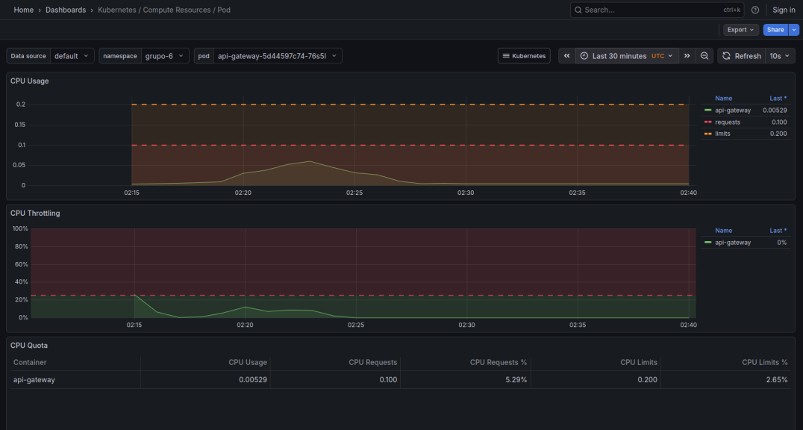
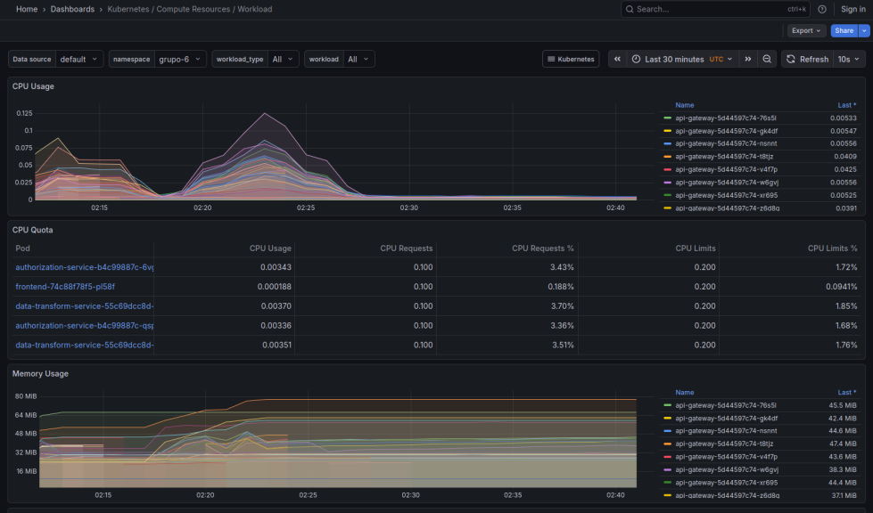
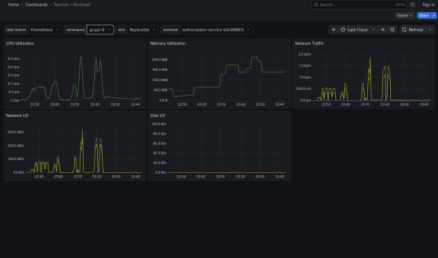
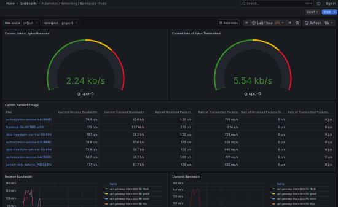

# Relatório - Monitoramento/Observabilidade de Aplicações em Cluster K8S

## Dados do curso

- Curso: Engenharia de Software - Faculdade UnB Gama
- Disciplina/Turma: PSPD - Programação para Sistemas Paralelos e Distribuídos, 2026/1
- Professor: Fernando W. Cruz
- Data dos testes: 12/07/2026
- Alunos participantes:
  - Arthur Augusto Rezende da Paixão - 211031600
  - Daniel Coimbra dos Santos - 180113097
  - Magno Luiz Vale Vieira - 180042696

## 1. Introdução

O trabalho consistiu em implantar, testar e observar uma aplicação hospitalar baseada em microsserviços em um cluster Kubernetes compartilhado. A aplicação simula um pseudo-prontuário eletrônico, com autenticação via Keycloak, autorização baseada em perfil, acesso a dados clínicos em PostgreSQL, transformação para recursos HL7/FHIR e exposição de métricas para Prometheus/Grafana.

O objetivo principal foi avaliar o comportamento da aplicação em ambiente distribuído, considerando tanto a funcionalidade quanto o desempenho sob carga. Para isso, foram executadas validações funcionais, testes de carga progressivos, ajustes de escalabilidade horizontal, configuração de HPA e coleta de evidências de observabilidade.

Este relatório descreve a arquitetura implantada, a metodologia usada pelo grupo, a experiência de uso do cluster Kubernetes, os resultados dos testes com k6, a configuração final de autoscaling e os dashboards utilizados para acompanhar CPU, memória, rede e workloads do namespace `grupo-6`.

## 2. Metodologia de trabalho do grupo

O trabalho foi conduzido em etapas incrementais. Primeiro, o grupo revisou a arquitetura da aplicação e os contratos entre serviços. Em seguida, a aplicação foi ajustada para o ambiente real do professor, pois o banco de dados, o Keycloak e o cluster compartilhado tinham detalhes diferentes do ambiente local inicialmente previsto.

A metodologia adotada seguiu cinco frentes:

1. Validação funcional dos fluxos de acesso.
2. Adequação ao schema real do banco do professor.
3. Implantação no Kubernetes com Ingress público.
4. Execução de testes de carga progressivos com k6.
5. Observação do comportamento da aplicação via Prometheus/Grafana.

| Encontro | Pauta | Decisões / resultados |
|---|---|---|
| 1 | Definição da arquitetura | Separação em API Gateway, Authorization Service, Patient Data Service, Data Transform Service, frontend e banco PostgreSQL. |
| 2 | Integração com autenticação | Uso do Keycloak do cluster do professor, realm `grupo06` e cliente `admin-cli` para os testes automatizados. |
| 3 | Deploy no cluster | Ajuste dos manifests para namespace `grupo-6`, imagens `coimbrasdan/hospital-*:g6` e Ingress em `/grupo6`. |
| 4 | Testes de carga | Execução de cenários k6 com 10, 50, 100, 500 e 1000 usuários virtuais. |
| 5 | Ajustes e consolidação | Alinhamento com schema real do banco, cache TTL curto, HPA e consolidação das evidências. |

Durante a execução, os resultados de cada etapa foram usados para orientar a próxima decisão técnica. Por exemplo, os primeiros testes apontaram incompatibilidades com o schema real do banco e latência elevada em carga alta. A partir disso, foram corrigidas queries, adicionados caches de curta duração e ajustada a política de HPA.

## 3. Arquitetura da aplicação

A aplicação é composta por um frontend, um API Gateway e três microsserviços gRPC. O API Gateway concentra a interface HTTP externa e chama os serviços internos para validar acesso, buscar dados clínicos e transformar respostas para o formato esperado.

```text
Frontend
  -> API Gateway (REST/JWT)
      -> Authorization Service (gRPC)
      -> Patient Data Service (gRPC -> PostgreSQL)
      -> Data Transform Service (gRPC -> HL7/FHIR)

Keycloak -> emissão de tokens
Prometheus/Grafana -> métricas e dashboards
```

O `Authorization Service` decide se um usuário pode acessar determinada informação e qual nível de exposição deve ser aplicado. O `Patient Data Service` é o único componente que acessa diretamente as tabelas clínicas. O `Data Transform Service` adapta os dados para recursos FHIR e aplica anonimização ou redução de campos quando necessário.

Essa separação deixa as responsabilidades mais claras: autenticação e entrada HTTP ficam no gateway, regras de autorização ficam isoladas, dados clínicos ficam centralizados em um serviço específico e a transformação de formato fica separada do acesso ao banco.

## 4. Experiência de montagem do Kubernetes em modo cluster

O ambiente usado nos testes finais foi o cluster compartilhado fornecido pelo professor, acessado pelo arquivo `k8s/base/kubeconfig-grupo-6.yaml`. A aplicação foi implantada no namespace `grupo-6` e exposta publicamente por Ingress em:

```text
https://kiriland.unb.br/grupo6
```

Os componentes de monitoramento Prometheus/Grafana já estavam disponíveis no cluster compartilhado via Rancher Monitoring. Por isso, os manifests locais de `k8s/monitoring/` não foram aplicados. Essa decisão evitou conflitos com recursos cluster-wide e permissões que o service account do grupo não possuía.

Os principais comandos usados para validar o ambiente foram:

```bash
kubectl get pods -n grupo-6 -o wide --kubeconfig=k8s/base/kubeconfig-grupo-6.yaml
kubectl top pods -n grupo-6 --kubeconfig=k8s/base/kubeconfig-grupo-6.yaml
kubectl get hpa -n grupo-6 --kubeconfig=k8s/base/kubeconfig-grupo-6.yaml
kubectl get ingress -n grupo-6 --kubeconfig=k8s/base/kubeconfig-grupo-6.yaml
```

Uma limitação observada foi que o usuário do grupo não tinha permissão para listar recursos em todos os namespaces. Isso impediu, por exemplo, listar diretamente os Services ou Ingresses do Grafana em `cattle-monitoring-system`. A solução foi acessar o Grafana pela URL exposta pelo Rancher e filtrar os dashboards pelo namespace `grupo-6`.

Durante o teste de 1000 VUs, o HPA chegou ao seguinte estado:

| Componente | Alvo HPA | Réplicas |
|---|---:|---:|
| API Gateway | CPU 40% | 10 |
| Authorization Service | CPU 40% | 10 |
| Patient Data Service | CPU 40% | 10 |
| Data Transform Service | CPU 40% | 5 |

## 5. Validação funcional

A validação funcional foi feita pela rota pública da aplicação, usando tokens emitidos pelo Keycloak:

```text
KEYCLOAK_URL=https://kiriland.unb.br/keycloak
Realm=grupo06
client_id=admin-cli
```

O `admin-cli` gera tokens aceitos pelo Keycloak, mas sem todos os claims de usuário/perfil esperados pela aplicação. Para os testes automatizados, o gateway aceita tokens válidos desse cliente e usa o cabeçalho `X-Username` para identificar o usuário de teste. Essa adaptação foi restrita ao fluxo de teste e deve ser substituída por um client da aplicação com claims completos em um ambiente produtivo.

Os cenários funcionais buscaram cobrir os quatro níveis principais de acesso da especificação:

| Perfil | Query | Resultado esperado | Resultado obtido |
|---|---|---|---|
| Médico vinculado | `ResumoClinico` | `ALLOW + FULL` | 200 OK, bundle FHIR com dados completos |
| Médico não vinculado | `ResumoClinico` | `DENY` | 403 OK esperado |
| Estagiário supervisionado | `ResumoClinico` | `ALLOW + PARTIAL` | 200 OK, dados parciais |
| Pesquisador com projeto vigente | `Estatisticas` | `ALLOW + AGGREGATED` | 200 OK, estatísticas agregadas |
| Pesquisador sem acesso ao projeto | `Estatisticas` | `DENY` | 403 OK esperado |

A aplicação precisou ser corrigida para usar o schema real do banco do professor. Os principais ajustes foram: IDs textuais no banco, enums em caixa alta, tabela `user_patient_assignments`, valores clínicos armazenados como texto e consultas agregadas com cast seguro para numérico.

Essa etapa foi importante porque garantiu que os testes de carga não estariam medindo uma aplicação quebrada ou incompatível com a infraestrutura real. Após os ajustes, a aplicação respondeu corretamente aos perfis testados e passou a usar dados persistidos no banco real do grupo.

## 6. Testes de carga

Ferramenta: k6. O cenário mistura chamadas de resumo clínico para médicos/estagiários e estatísticas agregadas para pesquisadores. A taxa de erro considera falhas HTTP/rede; respostas 403 esperadas por regra de acesso foram contabilizadas separadamente como negativas de autorização, não como erro de aplicação.

Os testes foram executados com 10, 50, 100, 500 e 1000 usuários virtuais. A estratégia foi começar com carga baixa para confirmar estabilidade básica e depois aumentar progressivamente até encontrar sinais de saturação, como crescimento de latência, timeouts ou aumento da taxa de erro.

As principais métricas analisadas foram:

- throughput em requisições por segundo;
- latência média;
- p95 de latência;
- taxa de erro;
- número total de iterações concluídas;
- comportamento de CPU, memória e rede no Grafana.

### 6.1 Baseline com 1 réplica por serviço

| Usuários | Throughput (req/s) | Latência média (ms) | p95 (ms) | Taxa de erro (%) | Iterações |
|---:|---:|---:|---:|---:|---:|
| 10 | 6.13 | 92.41 | 141.72 | 0.00 | 549 |
| 50 | 19.53 | 798.64 | 1574.82 | 0.00 | 1788 |
| 100 | 21.05 | 2530.10 | 3403.46 | 0.00 | 1942 |
| 500 | 20.39 | 6431.33 | 9054.80 | 0.00 | 1931 |
| 1000 | 22.68 | 6058.99 | 12738.39 | 11.88 | 2146 |

O baseline mostra que a aplicação suportou cargas menores sem erro, mas a latência cresceu rapidamente a partir de 100 usuários. Em 1000 VUs, a taxa de erro chegou a 11,88%, indicando que a configuração com uma única réplica não era suficiente para a carga máxima exigida.

### 6.2 Resultado após ajustes de cache e HPA

| Usuários | Throughput (req/s) | Latência média (ms) | p95 (ms) | Taxa de erro (%) | Iterações |
|---:|---:|---:|---:|---:|---:|
| 500 | 66.32 | 1781.54 | 5786.48 | 0.00 | 6463 |
| 1000 | 67.94 | 1751.26 | 6135.46 | 1.05 | 6552 |

Os resultados mostram ganho claro de throughput e redução da taxa de erro depois dos ajustes. Em 1000 VUs ainda ocorreram timeouts de conexão (`dial i/o timeout` e `request timeout`), mas a taxa final ficou em 1,05%, abaixo do limite de 5% usado no k6.

O principal efeito observado foi a redução de erros e a melhoria do throughput. A latência p95 continuou na faixa de segundos em carga alta, o que indica que ainda existem limites no caminho externo/Ingress ou em chamadas síncronas internas, mas a configuração final foi significativamente mais estável que o baseline.

## 7. Escalabilidade horizontal

Antes do HPA, a aplicação foi testada com uma única réplica por serviço para estabelecer o baseline. Em seguida, os serviços principais foram escalados horizontalmente e o HPA passou a controlar as réplicas.

| Configuração | Usuários | Throughput (req/s) | Latência média (ms) | p95 (ms) | Observações |
|---|---:|---:|---:|---:|---|
| 1 réplica | 500 | 20.39 | 6431.33 | 9054.80 | Sem erros, mas latência alta |
| HPA ajustado | 500 | 66.32 | 1781.54 | 5786.48 | 0% erro, maior throughput |
| 1 réplica | 1000 | 22.68 | 6058.99 | 12738.39 | 11.88% erro |
| HPA ajustado | 1000 | 67.94 | 1751.26 | 6135.46 | 1.05% erro |

O ganho mais importante foi a redução de erros em 1000 VUs. O gargalo restante parece estar no caminho externo/Ingress e no custo de chamadas síncronas sob alta concorrência, já que os erros observados foram majoritariamente timeouts de conexão.

A escalabilidade horizontal melhorou o comportamento geral porque distribuiu requisições entre múltiplos pods. Entretanto, ela não elimina todos os gargalos: banco de dados, Ingress, limites de rede e chamadas gRPC sequenciais continuam influenciando a latência final.

## 8. Autoscaling (HPA)

Configuração final aplicada:

| Serviço | Min réplicas | Max réplicas | Alvo CPU |
|---|---:|---:|---:|
| API Gateway | 6 | 10 | 40% |
| Authorization Service | 6 | 10 | 40% |
| Patient Data Service | 6 | 10 | 40% |
| Data Transform Service | 3 | 10 | 40% |

O mínimo acima de 1 foi necessário porque os cenários de carga do trabalho são curtos. Com mínimos baixos, o HPA reagia tarde demais e a latência p95 subia antes da criação das réplicas. Durante 1000 VUs, gateway, autorização e patient-data atingiram 10 réplicas.

A escolha de CPU alvo em 40% também foi feita por causa da duração curta dos testes. Um alvo menor força o HPA a escalar mais cedo, o que é útil em cargas intensas e rápidas. Em um ambiente produtivo real, esse valor poderia ser recalibrado com base em testes mais longos e padrões reais de tráfego.

Comandos usados:

```bash
kubectl get hpa -n grupo-6 --kubeconfig=k8s/base/kubeconfig-grupo-6.yaml
kubectl top pods -n grupo-6 --kubeconfig=k8s/base/kubeconfig-grupo-6.yaml
kubectl get pods -n grupo-6 -o wide --kubeconfig=k8s/base/kubeconfig-grupo-6.yaml
```

## 9. Observabilidade

Os serviços expõem métricas Prometheus por anotações `prometheus.io/scrape`, `prometheus.io/port` e `prometheus.io/path`. As métricas principais acompanhadas foram:

| Métrica | Fonte | O que mede |
|---|---|---|
| `gateway_http_requests_total` | API Gateway | Requisições HTTP por rota/status |
| `gateway_http_request_duration_seconds` | API Gateway | Latência HTTP |
| `gateway_authz_denials_total` | API Gateway | Negativas de autorização |
| `patientdata_requests_total` | Patient Data Service | Chamadas gRPC por método |
| `patientdata_db_queries_total` | Patient Data Service | Volume de consultas SQL |
| `patientdata_request_latency_seconds` | Patient Data Service | Latência do serviço de dados |
| `transform_requests_total` | Data Transform Service | Transformações FHIR por método |
| CPU/memória por pod | metrics-server/Grafana | Efeito do HPA e uso de recursos |

As evidências visuais foram coletadas no Grafana/Rancher Monitoring, filtrando sempre o namespace `grupo-6`. Os prints mostram uso de CPU, memória, rede e comportamento dos workloads durante ou logo após a execução dos testes de carga.



Figura 1 - Dashboard Kubernetes / Compute Resources / Pod, filtrado por `namespace=grupo-6` e por um pod do `api-gateway`. O painel mostra uso de CPU, requests, limits e throttling. O pico registrado coincide com a janela dos testes k6, enquanto o valor final cai após o encerramento da carga.



Figura 2 - Dashboard Kubernetes / Compute Resources / Workload, filtrado por `namespace=grupo-6` e `workload=All`. O painel consolida CPU e memória dos pods dos deployments do grupo, permitindo comparar `api-gateway`, `authorization-service`, `patient-data-service`, `data-transform-service` e `frontend`.



Figura 3 - Dashboard Rancher / Workload, filtrado por `namespace=grupo-6`, `kind=ReplicaSet` e workload do `authorization-service`. A figura evidencia picos de CPU, crescimento de memória e tráfego de rede na mesma janela dos testes de carga.



Figura 4 - Dashboard Kubernetes / Networking / Namespace (Pods), filtrado por `namespace=grupo-6`. O painel mostra bytes recebidos/transmitidos e uso de rede por pod, comprovando que a observabilidade foi isolada para os recursos do grupo 06.

Esses dashboards complementam os resultados do k6 porque mostram o efeito da carga no cluster: aumento de CPU nos pods da aplicação, crescimento de memória nos workloads e tráfego de rede concentrado nos pods do namespace do grupo.

## 10. Dificuldades encontradas

As principais dificuldades foram relacionadas à diferença entre o ambiente local e o ambiente real do professor. O banco compartilhado usava schema diferente do schema local inicial, com IDs textuais, enums em caixa alta e valores clínicos armazenados como texto. Isso exigiu correções no `Patient Data Service`, no seed e nas queries agregadas.

Outro ponto foi a autenticação. O client `admin-cli` funcionou para obter tokens via Password Grant, mas os tokens não carregavam todos os claims esperados pela aplicação. Para viabilizar os testes de carga, foi adotado um fluxo controlado no gateway, aceitando o token válido e usando `X-Username` para identificar o usuário do teste.

Também houve limitação de acesso no cluster: o service account do grupo não podia listar recursos em todos os namespaces, o que exigiu acessar o Grafana pelo Rancher e trabalhar com filtros por namespace nos dashboards.

## 11. Conclusão

A aplicação foi implantada no cluster do professor, integrada ao Keycloak e ao banco PostgreSQL real do grupo. Os principais problemas corrigidos foram incompatibilidades com o schema real, ausência de claims completos no token de teste, consultas repetitivas sob carga, HPA ausente e parâmetros de carga pouco ajustáveis.

O baseline com 1 réplica mostrou degradação forte a partir de 100 usuários e falha relevante em 1000 usuários. A configuração final com cache TTL curto e HPA reduziu a taxa de erro de 11,88% para 1,05% em 1000 VUs e aumentou o throughput de 22,68 req/s para 67,94 req/s.

Como limitação, em 1000 VUs ainda houve timeouts de rede/conexão no caminho público. Para evoluir o projeto, seria recomendável publicar imagens Docker definitivas com as correções, usar um client Keycloak próprio da aplicação com claims completos, revisar limites do Ingress e adicionar cache distribuído ou filas para rotas mais custosas.

### Comentários pessoais

**Arthur Augusto Rezende da Paixão**  
Atuou na organização do deploy e validação da aplicação no cluster. Principais aprendizados: relação entre manifests, namespace, Ingress e observabilidade.

**Daniel Coimbra dos Santos**  
Atuou na integração dos microsserviços, ajustes de imagem/manifests e testes de carga. Principais aprendizados: impacto de HPA e gargalos de chamadas síncronas.

**Magno Luiz Vale Vieira**  
Atuou na análise dos resultados e consolidação do relatório. Principais aprendizados: interpretação de métricas Prometheus/Grafana e trade-offs de escalabilidade.

## 12. Referências

[1] Arundel, J. and Domingus, J. Cloud Native DevOps with Kubernetes - Building, Deploying and Scaling Modern Applications in the Cloud, O'Reilly, 2019.

[2] HL7 FHIR. Disponível em: https://www.hl7.org/fhir/

[3] Kubernetes Documentation. Disponível em: https://kubernetes.io

[4] Prometheus Documentation. Disponível em: https://prometheus.io

[5] Grafana Documentation. Disponível em: https://grafana.com/docs/
